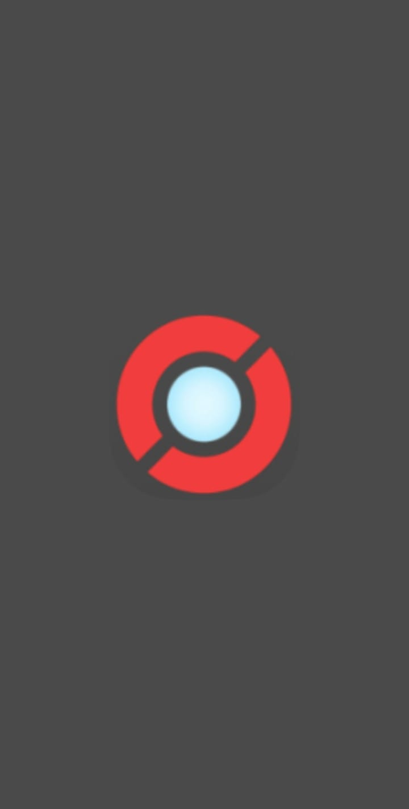
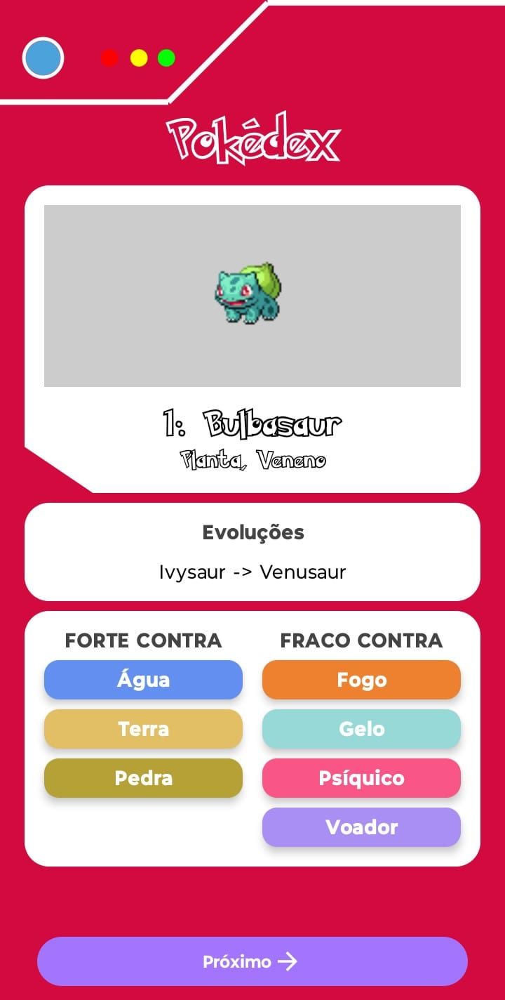

<h1 align="center">
   Kotlin Applications
</h1>

<div align="center">


</div>

## 📖 Descrição

Uma pequena coleção de aplicações de exemplo em Kotlin e projetos de amostra para Android.

## 🧞 Visão geral do repositório

Este repositório contém múltiplos projetos em Kotlin agrupados em duas áreas principais:

- Exemplos de CLI: exemplos leves em Kotlin para linha de comando.
- Aplicativos GUI (Android): pequenos aplicativos Android organizados como subprojetos separados (por exemplo, BlessedPhrases, Magic8Ball, Pokedex).

Cada subprojeto Android é autocontido e inclui seu próprio Gradle wrapper e configuração em `gui/src/<ProjectName>/`.

## 📁 Estrutura do repositório (visão geral)

- `cli/` — exemplos simples em Kotlin para linha de comando (demos de um único arquivo).
- `gui/src/` — aplicativos de exemplo para Android. Cada app está em sua própria pasta e inclui um módulo `app/` e o Gradle wrapper.

## 🚀 Projetos

### 🔎 Pokedex

**📂 Pasta:** `Pokedex/`  
**🎯 Descrição:** Aplicativo de exemplo Android que implementa uma Pokédex com tela de listagem e detalhe de Pokémon. Demonstra práticas modernas de arquitetura e UI, incluindo componentes modularizados, cards de tipos com visualização de força/weakness e suporte a evolução/linhas. Ideal como referência para aprender sobre navegação, ViewModel, datasets locais e organização de recursos em um app Android.

#### 📱 Telas

<div align="center">
<table align="center" style="border-collapse:collapse;">
  <tr>
    <td style="padding:8px; text-align:center; vertical-align:top;">
      <p style="margin:0 0 8px 0; font-weight:700;">Splash</p>
      
    </td>
    <td style="padding:8px; text-align:center; vertical-align:top;">
      <p style="margin:0 0 8px 0; font-weight:700;">Home</p>
      
    </td>
  </tr>
</table>
</div>

#### ✨ Funcionalidades

- **📋 Listagem e detalhe:** Listagem paginada/rolável de Pokémon e tela de detalhe com informações e estatísticas.
- **🎴 Cards de tipo:** Visualização por tipo com indicação de forças e fraquezas entre tipos.
- **🔁 Evolução / Linhas:** Visualização das linhas de evolução e relações entre espécies.
- **🧭 Navegação:** Navegação entre telas com back stack e top bar reutilizável.
- **📦 Dataset local:** Uso de dataset local e recursos (imagens/icones) para demonstração offline.
- **🧩 Componentes reutilizáveis:** UI dividida em componentes pequenos e reutilizáveis (cards, lists, headers).

#### 🧰 Tecnologias Utilizadas

- **Linguagem:** Kotlin
- **Arquitetura:** MVVM (ViewModel + LiveData/StateFlow)
- **UI:** AndroidX, Material Components, components Jetpack (RecyclerView / Compose if applicable)
- **Build:** Gradle (wrapper incluído)
- **Outros:** Uso de recursos locais (drawable, layouts, strings) e configurações ProGuard quando aplicável

#### 🔬 Recursos Demonstrados

- **Arquitetura desacoplada:** Separação entre UI, lógica e dados.
- **Componentização da UI:** Cards e componentes menores reaproveitáveis.
- **Gerenciamento de estado:** ViewModel e padrões de atualização de UI.

#### 🎯 Características Técnicas

- **Referência didática:** Projeto pensado como exemplo para aprendizado e experimentação.
- **Offline-friendly:** Funciona com dataset local para evitar dependências externas.
- **Fácil de estender:** Arquitetura preparada para adicionar APIs, testes ou internacionalização.

---

## 🔧 Pré-requisitos

- JDK 11 ou superior (dependendo dos requisitos do Android Gradle Plugin usados nos projetos).
- Compilador de linha de comando do Kotlin (`kotlinc`) caso queira compilar os exemplos CLI sem usar o Gradle.
- Android Studio (recomendado) ou Android SDK + Gradle para construir os projetos Android.

## ⚙️ Build e execução

Exemplo CLI (Hello World)

Você pode compilar e executar o exemplo simples de CLI em Kotlin diretamente com o compilador Kotlin:

```bash
# a partir da raiz do repositório

# Compilar
kotlinc cli/src/01_hello_world/HelloWorld.kt -d out

# Executar (o nome da classe vira HelloWorldKt para um main em top-level)
kotlin -cp out HelloWorldKt
```

---

**Apps Android** (BlessedPhrases, Magic8Ball, Pokedex)

Cada subprojeto Android contém seu próprio Gradle wrapper. Para construir um app específico, entre na pasta do projeto e use o wrapper. Por exemplo, para montar um APK debug do Pokedex:

```bash
# Entre no diretório do projeto Pokedex
cd gui/src/Pokedex

# Build do APK em modo debug
./gradlew assembleDebug

# Para instalar em um dispositivo conectado:
./gradlew installDebug
```

Como alternativa, abra o projeto no Android Studio (preferível para desenvolvimento) e importe o projeto Gradle — o Android Studio cuidará da configuração do SDK/Gradle para você.

---

## 👤 Sobre o Desenvolvedor

<div align="center">

<table>
  <tr>
    <td align="center">
        <br>
        <a href="https://github.com/0nF1REy" target="_blank">
          
        </a>
        </p>
        <a href="https://github.com/0nF1REy" target="_blank">
          <strong>Alan Ryan</strong>
        </a>
        </p>
        ☕ Peopleware | Tech Enthusiast | Code Slinger ☕
        <br>
        Apaixonado por código limpo, arquitetura escalável e experiências digitais envolventes
        </p>
          Conecte-se comigo:
        </p>
        <a href="https://www.linkedin.com/in/alan-ryan-b115ba228" target="_blank">
          
        </a>
        <a href="https://gitlab.com/alanryan619" target="_blank">
          
        </a>
        <a href="mailto:alanryan619@gmail.com" target="_blank">
          
        </a>
        </p>
    </td>
  </tr>
</table>

</div>

---

## 📜 Licença <a name="licenca"></a>

Este projeto está sob a **licença MIT**. Consulte o arquivo **[LICENSE](LICENSE)** para obter mais detalhes.

> ℹ️ **Aviso de Licença:** © 2025 Alan Ryan da Silva Domingues. Este projeto está licenciado sob os termos da licença MIT. Isso significa que você pode usá-lo, copiá-lo, modificá-lo e distribuí-lo com liberdade, desde que mantenha os avisos de copyright.

⭐ Se este repositório foi útil para você, considere dar uma estrela!
